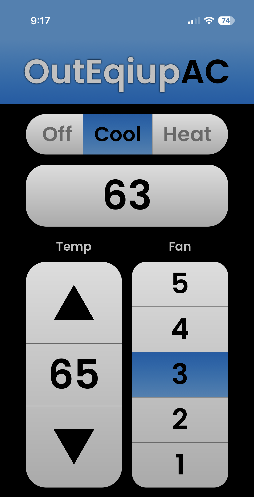
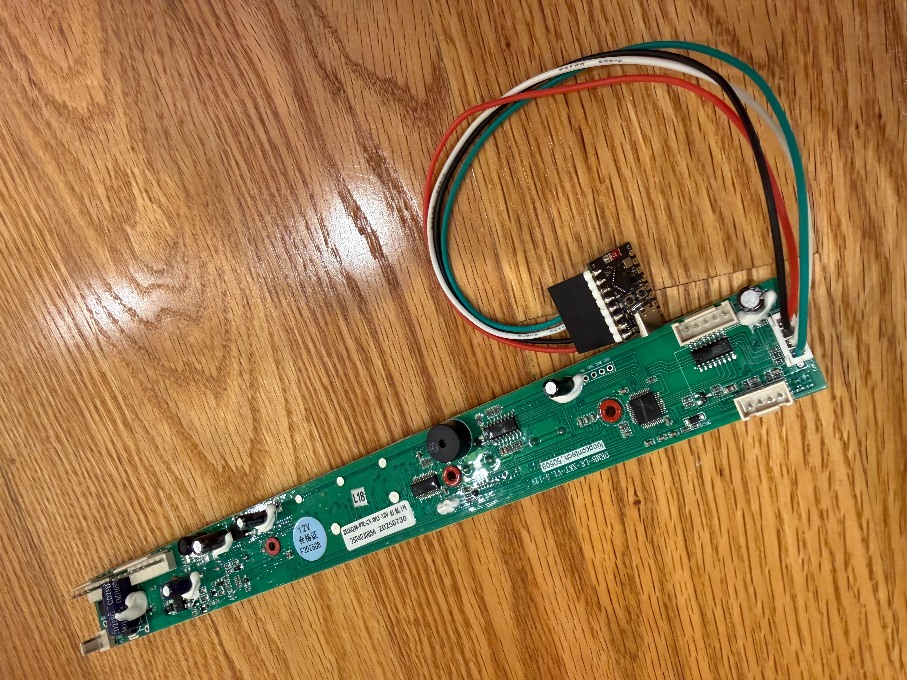

This project provides an ESPHome-based custom component to allow remote monitoring and control of OutEquipPro AC units (such as the Summit2) using an ESP32 microcontroller (e.g. ESP32-C3 Super Mini or Wemos C3 Mini) as a smart WiFi bridge.

It integrates seamlessly with **Home Assistant** via the native ESPHome API and also features a gorgeous, standalone responsive web dashboard.

<!--<p align="center"></p>-->

---

## Features

- **Native Home Assistant Integration**: Seamless auto-discovery, custom climate controls, and high-performance sensor/switch entity mappings.
- **Custom Premium Web UI**: A beautiful, mobile-friendly thermostat dashboard served directly from the ESP32 at `/thermostat`.
- **Full Sensor Suite**: Real-time tracking of intake temperature, outlet temperature, voltage, and safety protections (undervolt, overvolt).
- **Control Options**: Mode switching (Cool, Heat, Fan Only, Off), fan speed adjustment (Low, Medium, High), and secondary controls (LCD Backlight, Swing, Light).
- **ESPHome Ecosystem Benefits**: Zero-config captive portal for WiFi onboarding, seamless Over-the-Air (OTA) updates, and standard ESPHome logs interface.

---

## Requirements

- **ESP32-C3 Microcontroller** (e.g., [ESP32-C3 Super Mini](https://www.wemos.cc/en/latest/c3/c3_mini.html) or Wemos C3 Mini)
- **Soldering Iron & Solder**
- **Thin Stranded Wire** (e.g., 22AWG or 28AWG silicone wire)
- **Affixing Material** (double-sided tape, hot glue, or zip ties)

---

## Installation & Setup

### 1. Software Installation (Flash First!)

> [!CAUTION]
> **Flash the microcontroller _before_ wiring it to your A/C.**
> 
> This prevents potential hardware damage caused by connecting your computer's USB port to an ESP32 that is simultaneously being powered by the A/C control board's 5V line.

1. **Install ESPHome** on your computer if you haven't already:
   ```bash
   pip install esphome
   ```
2. **Clone this repository** and navigate to its root directory:
   ```bash
   git clone https://github.com/yourusername/OutEquipAC.git
   cd OutEquipAC
   ```
3. **Configure WiFi (Optional)**:
   By default, if the ESP32 cannot connect to a network, it will launch a hotspot named **OutEquip AC Fallback** (with a captive portal to select your WiFi network).
   If you prefer to hardcode your WiFi credentials directly:
   - Edit `outequip_ac.yaml` to include your details under the `wifi:` block:
     ```yaml
     wifi:
       networks:
         - ssid: "YOUR_WIFI_SSID"
           password: "YOUR_WIFI_PASSWORD"
     ```
4. **Compile and Flash**:
   - Connect the ESP32 to your computer using a USB cable (ensure the A/C is disconnected).
   - Run the compile and upload command:
     ```bash
     esphome run outequip_ac.yaml
     ```
   - This command downloads dependencies, compiles the local custom components, uploads the firmware over USB, and launches the live log viewer.

---

### 2. Hardware Installation



1. **Solder wires** onto the control board pads labeled `5V`, `GND`, `RX`, and `TX`. The additional `CAN_RX` and `CAN_TX` pins can be left unpopulated.
2. **Connect the other ends** of the wires to the appropriate pins on your ESP32. By default, the pin mappings are:

| Control Board Pad | C3 Mini Pin | Description |
| :---------------- | :-------------------------------- | :---------- |
| **5V**            | **VBUS** (or 5V / Vin)            | Power Input |
| **GND**           | **GND**                           | Ground      |
| **RX**            | **GPIO 4**                        | UART TX     |
| **TX**            | **GPIO 3**                        | UART RX     |

3. **Secure the components**: Once connected, use tape, hot glue, or zip ties to secure the ESP32 in place.

> [!NOTE]
> Affix the ESP32 in a location that protects it from humidity and avoids contact with metal, such as the air conditioner's mounting brackets.

---

## Configuration & Usage

### WiFi Setup (Captive Portal)
If you did not hardcode your WiFi credentials, the ESP32 will broadcast a WiFi access point named **OutEquip AC Fallback**.
1. Connect to this network on your phone or computer.
2. The captive portal configuration page should open automatically. If not, open your web browser and navigate to `http://192.168.4.1`.
3. Select your local home WiFi network, enter your password, and save.

### Accessing the Custom Web Interface
Once the ESP32 connects to your local network, you can access it via browser:
- **Standard ESPHome Dashboard**: `http://outequip-ac.local/` (gives direct access to raw entity controls, status indicators, and built-in OTA updates).
- **Premium Custom UI**: `http://outequip-ac.local/thermostat` (a premium, responsive mobile-friendly dashboard styled exactly like the screenshot above).

### Home Assistant Integration
Since the ESPHome native API is active:
1. Open **Home Assistant**.
2. Go to **Settings -> Devices & Services**.
3. **OutEquip AC** will be automatically discovered! Click **Configure**, approve, and assign it to an area.
4. You can now control the AC with any standard Lovelace Climate card and view all temperatures/sensors on your dashboard.

---

## How It Works

This project is built as a native **ESPHome External Component** located in the `components/` directory:

- **Local Inclusion**: The `outequip_ac.yaml` configures the compiler to fetch components locally using the `external_components` block.
- **Wired Serial Interface**: The ESP32 communicates with the control board using [a binary protocol](protocol.md). The code polls the board for state changes and pushes commands as requested. (On Bluetooth-enabled control boards, this serial interface is populated with a Bluetooth module; otherwise, it is unpopulated. Soldering directly to these pads allows the ESP32 to interface with the system).
- **Embedded Web UI**: At compile time, the custom web interface inside `components/outequip_ac/thermostat.html` is automatically gzipped and embedded as a raw byte array inside the C++ build directory. It is served with high performance directly by the web server at `/thermostat`.
- **Gzip Compression**: Compressing the HTML and icons reduces memory usage on the ESP32's flash and speeds up browser load times significantly.

---

## Troubleshooting

- **No Data / Connection Fails**: Verify that RX and TX are not swapped. The ESP32's TX (GPIO 4) should connect to the A/C board's RX, and the ESP32's RX (GPIO 3) should connect to the A/C board's TX.
- **Microcontroller Bootloop/Brownout**: Ensure you are supplying clean 5V power to the `VBUS` / `5V` pin on the ESP32.
- **Live Logs**: Run `esphome logs outequip_ac.yaml` while connected to the same network (or via USB) to see real-time diagnostics and check protocol communication frames.

> [!CAUTION]
> Always disconnect the 5V line from the control board before connecting the ESP32 to your computer's USB port! Failing to do so can bridge the internal power supply of the A/C with your computer's USB power, risking permanent damage to both devices.
